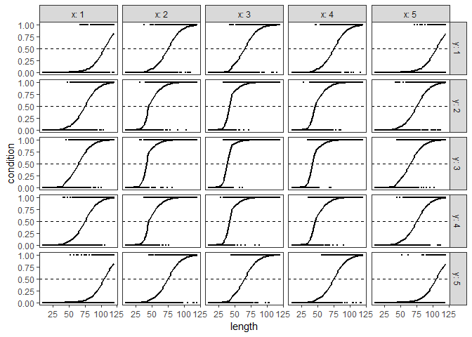
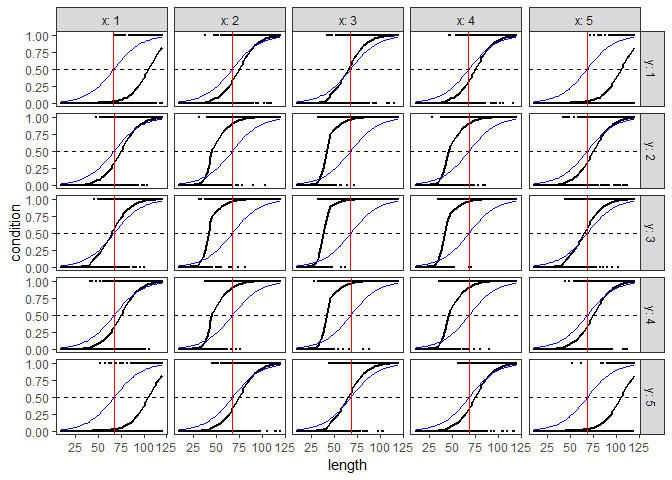
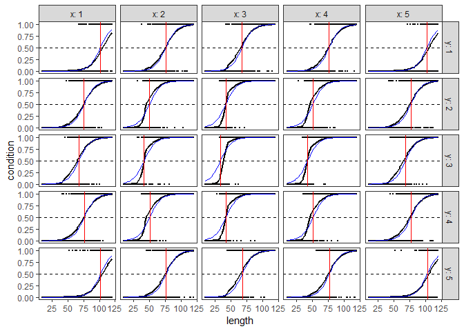
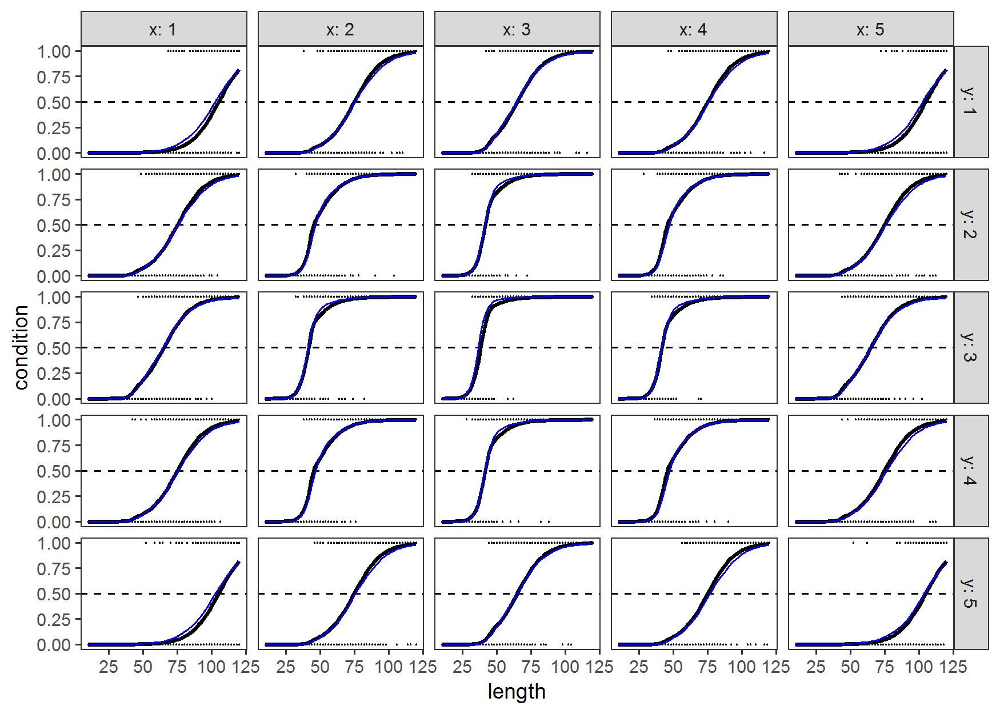
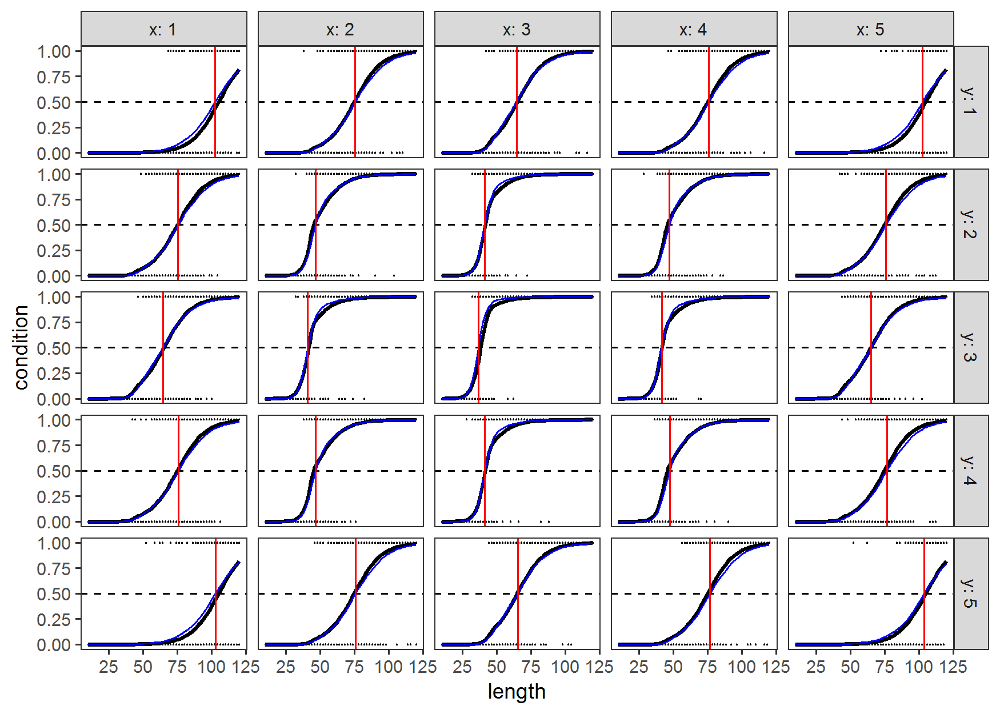
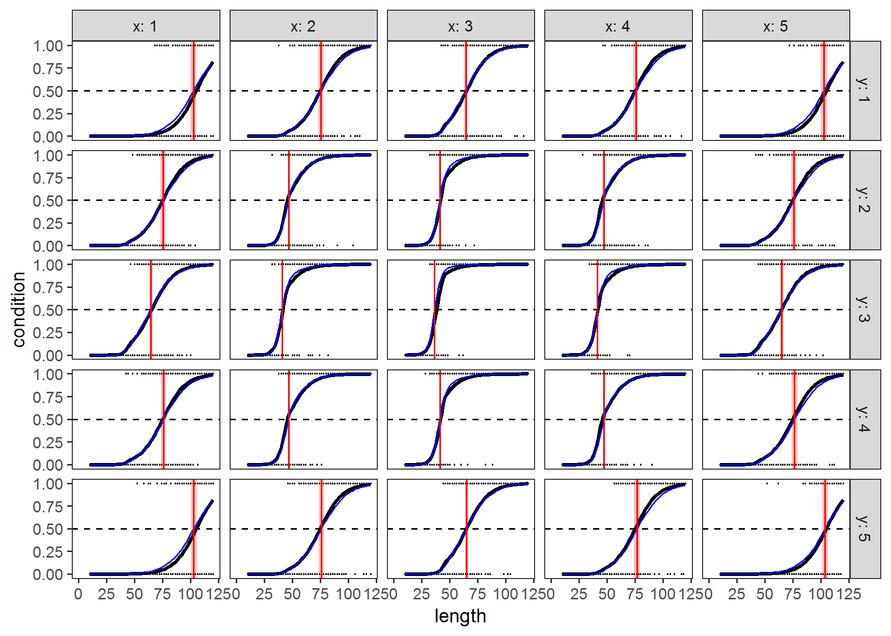

L50 estimation for GAMs
================
Eric Pedersen
September 17, 2018

This tutorial will focus on how to estimate L50 values for observational fisheries length-at-maturity data when the relationship between length and maturity is more complex than a logistic curve (so simple linear methods of calculating L50 values don't work). L50 values, in fisheries ecology, correspond to the length (or age) at which 50% of the individuals in a population have gone through some transition (e.g. have become sexually mature, or are producing eggs, or have undergone a sex transition).

For this tutorial, I'll use the following packages:

``` r
library(dplyr)   #for working with data frames
library(tidyr)   #for working with data frames
library(ggplot2) #for generating plots
library(mgcv)    #for fitting nonlinear (generalized additive) models

set.seed(1)
```

I'll use the following generated data set. I'll be assuming that we have survey values sampled from a spatial grid (indexed by `x` and `y`) and that length at maturity follows a non-linear function of length, with the intercept depending on `x` and `y`:

``` r
dat = crossing(x = 1:5,  #x and y occur across a 5x5 grid
               y = 1:5, 
               #2 mm length bins, spanning from 10 to 120 mm.
               length = seq(10,120, by = 2), 
               #10 replicates at each size bin.
               rep = 1:10) %>%
  mutate(
    #create values on the link (logit) scale. In this data, maturation is
    #fastest in the middle of the range (x=3,y=3), and the length at maturity
    #curve is based off a two-part logistic function that changes slope at L = 45 mm
    prob_logit = 2 -(x-3)^2 - (y-3)^2 + ifelse(length<45, 0.3*(length-45),0.1*(length-45)),
    prob = plogis(prob_logit),
    condition = rbinom(n = n(), prob = prob,size = 1))
```

This is what the data looks like:

``` r
head(dat)
```

    ## # A tibble: 6 x 7
    ##       x     y length   rep prob_logit         prob condition
    ##   <int> <int>  <dbl> <int>      <dbl>        <dbl>     <int>
    ## 1     1     1     10     1      -16.5 0.0000000683         0
    ## 2     1     1     10     2      -16.5 0.0000000683         0
    ## 3     1     1     10     3      -16.5 0.0000000683         0
    ## 4     1     1     10     4      -16.5 0.0000000683         0
    ## 5     1     1     10     5      -16.5 0.0000000683         0
    ## 6     1     1     10     6      -16.5 0.0000000683         0

And here's a plot of the true length-at-maturity curves, with points showing raw data, the black curve indicating the true probability at length for a given `x,y` combination, and the horizontal dashed line indicating the L50 :

``` r
raw_data_plot = ggplot(dat, aes(x = length, y = condition))+ 
  facet_grid(y~x, labeller = label_both) + 
  geom_point(size=0.1)+
  geom_line(aes(y=prob), size=1)+
  geom_hline(yintercept = 0.5,linetype=2)+
  theme_bw()+
  theme(panel.grid = element_blank())
  

raw_data_plot
```



In logistic regression, the probability of some `condition`, , is modelled with a generalized linear model (GLM) with a binomial distribution for`condition` being in one state or another, and the logit-transformed value  = ln(p/(1-p))") being modelled as a linear combination of the variables (**x**) of interest:

 = \beta_0 + \beta_1*x_1 + \beta_2*x_2 + ...")

where  corresponds to an intercept, and , , etc. correspond to slopes for each variable of interest. In **R** code, this would be described by:

``` r
glm(condition ~ 1 + x_1 + x_2 + ..., data = dat, family=binomial(link = "logit"))
```

Where I have explicitly included the intercept should be included (the term `1`) and specified that the model should use a logit link.

In length-at-maturity analyses where length at maturity can vary with covariates, the equation would be:

 = \beta_0 + \beta_{length}*L + \beta_1*x_1 + \beta_2*x_2 + ...")

And the corresponding **R** model is:

``` r
glm(condition ~ 1 + length + x_1 + x_2 + ..., data = dat, family=binomial(link = "logit"))
```

For the sample data, the linear R model would be:

``` r
l_mat_linear = glm(condition ~ 1 + length + x + y, data = dat, family=binomial(link = "logit"))
```

For these models, L50 value for a given set of covariates is the the value of `length` that corresponds to =0") when the other covariates are held constant. In a standard GLM model, this can be found by solving a pretty straightforward linear equation:


")

This can be found in R pretty simply. First we'll create new data at the values we want to predict at. We have to create a dummy value of length to create predictions at, but we won't be using this value to calculate L50 values here:

``` r
dat_pred = crossing(x = unique(dat$x),
                    y = unique(dat$y),
                    length = 0, #dummy value of length. Set to zero so it will not affect the predictions
                    condition = 1 #dummy value of condition; will not affect predicted L50 values, but it is needed for building the model matrix.
                    )
```

Next we'll generate a *model matrix* from this, that creates the appropriate variables in the right order

``` r
linear_model_matrix = model.matrix(l_mat_linear$formula, dat_pred)
```

Now we can multiply this by the coefficient values from the model, divided by the coefficient value for length:

``` r
linear_coef = coef(l_mat_linear)

L50_numerator = linear_model_matrix%*%linear_coef #matrix multiplication of 
L50_denominator = linear_coef[["length"]]

dat_pred$L50_linear = -L50_numerator/L50_denominator
```

Let's see how well this does at estimating the true L50, by adding the predicted curve as a blue line, and the L50 values as a red vertical line to the previous plot.

``` r
linear_l50_plot = raw_data_plot +
  geom_line(aes(y=fitted(l_mat_linear)),color="blue")+
  geom_vline(data =dat_pred, aes(xintercept = L50_linear), linetype=1, color="red")
  

linear_l50_plot
```



Note that this does a really awful job of predicting the L50 values. Part of this is that we didn't model the quadratic relationship with space; we can add that in easily:

``` r
l_mat_quad = glm(condition ~ 1 + length + x +I(x^2) + y + I(y^2), data = dat, family=binomial(link = "logit"))

quad_model_matrix = model.matrix(l_mat_quad$formula, dat_pred)
quad_coef = coef(l_mat_quad)

L50_numerator = quad_model_matrix%*%quad_coef 
L50_denominator = quad_coef[["length"]]

dat_pred$L50_quad = -L50_numerator/L50_denominator

quad_l50_plot = raw_data_plot +
  geom_line(aes(y=fitted(l_mat_quad)),color="blue")+
  geom_vline(data =dat_pred, aes(xintercept = L50_quad), linetype=1, color="red")
  

quad_l50_plot
```



This works a fair bit better, but it's still not doing a great job for, e.g. `x=3, y=3`, and going by the blue lines, it seems to be because the estimated logistic curve doesn't capture the true size-at-maturity curve. I could add a quadratic term for length, or a length-location interaction term, but in that case, I couldn't use equation (1) to find the L50 values. In fact, equation (1) only works when we assume that the relationship between length and logit-probability is linear. When we move into the realm of nonlinear relationships, we have to find L50 using nonlinear solvers.

First, let's fit this model using a GAM:

``` r
l_mat_gam = gam(condition ~ 1 + s(length) +s(x, y, k=5), data = dat, family=binomial(link = "logit"))
```

Here the term `s(length)` denotes a smoother for length, and the term `s(x,y)` denotes a 2D smoother for x and y. This model does a much better job of capturing the length-at-maturity relationship:

``` r
gam_plot = raw_data_plot +
  geom_line(aes(y=fitted(l_mat_gam)),color="blue")

gam_plot
```



However, now how do we get the L50 values for this model? It's conceptually similar to how I did it for the linear model; basically, I'll find the value of `length` that results in the link equalling zero. However, the equation for the finding L50 is now:

 + g(x,y) \qquad (2)
")

where `f(length)` and `g(x,y)` are nonlinear equations. Now there is no easy linear equation like equation (1) to solve equation (2). However, R has good nonlinear optimizer codes that can easily solve this type of equation. Conceptually, we just want to, for a given set of `x` and `y` values, search through all length values to find one that solves equation (2).

I'll first define a function that can take a length, a vector of coefficients, and a data frame of covariates that we want predictions over, and returns the square of the link function for this data. I want the square value as the optimization functions in R assume I am minimizing a function, and the square of the link function will always have a minimum at zero (where equation (2) is satisified)[1].

``` r
get_link_sqrt = function(length, coefs, covar, model){
  covar$length = length
  #this returns the linear predictors corresponding to the new data. 
  lp_matrix = predict(model,newdata = covar, type="lpmatrix") 
  
  #to get predictions on the link scale, we'll use matrix multiplication to
  #multiply the lp_matrix times the vector of coefficients.
  link_pred = lp_matrix%*%coefs
  return(link_pred^2)
}
```

We can now use optimize to solve this equation for a single row of `dat_pred`. We have to set the interval that we want to optimize over (basically, the values we consider to be valid L50 values). Here we use 0 to 150.

``` r
test_l50 = optimize(get_link_sqrt,interval = c(0,150),
                    coefs = coef(l_mat_gam),
                    covar = dat_pred[1,], 
                    model = l_mat_gam)
print(test_l50)
```

    ## $minimum
    ## [1] 102.3863
    ## 
    ## $objective
    ##           [,1]
    ## 1 2.003677e-16

This returns a minimum value (i.e. the L50) and an objective value. If the function is properly minimizing, this will be very close to zero.

Now to get the L50 values for all sets of covariates, we can loop over the predicted data[2]:

``` r
dat_pred$L50_gam = 0 #creating an empty value here
#we also want to keep track of the objective function. If this deviates away
#from 0, it's a sign that the optimizer didn't,well, optimize.
dat_pred$objective = 0 

for(i in 1:nrow(dat_pred)){
  current_L50 = optimize(get_link_sqrt,interval = c(0,150),
                    coefs = coef(l_mat_gam),
                    covar = dat_pred[i,], 
                    model = l_mat_gam)
  dat_pred$L50_gam[i] = current_L50$minimum
  dat_pred$objective[i] = current_L50$objective
}
```

We can plot this to see how well it does:

``` r
gam_l50_plot = raw_data_plot +
  geom_line(aes(y=fitted(l_mat_gam)),color="blue")+
  geom_vline(data =dat_pred, aes(xintercept = L50_gam), linetype=1, color="red")
  

gam_l50_plot
```



And we can see that all of the estimates have converged properly, as the optimal criteria is very close to zero for all L50 values:

``` r
dat_pred$objective
```

    ##  [1] 2.003677e-16 2.911857e-13 1.482868e-15 3.066515e-13 2.565255e-16
    ##  [6] 2.891587e-13 5.516502e-13 1.116130e-13 5.973890e-13 3.413932e-13
    ## [11] 1.505867e-15 1.125319e-13 1.253650e-12 2.042231e-13 1.056623e-15
    ## [16] 3.013204e-13 5.914159e-13 2.296293e-13 6.967089e-13 3.142159e-13
    ## [21] 2.469956e-16 3.384410e-13 1.117079e-15 3.157200e-13 2.225998e-16

Note that, as a nonlinear solver, this isn't guaranteed to find an optimimum, and as this function is nonlinear, it's possible to have multiple L50 values! This should be pretty rare in actual data, but can happen with sampling issues, or when trying extrapolate predicted L50 values for unobserved covariate combinations. Note also that if you give a maximum or minimum value of length outside the range of the data, `gam` will happily give you a linear extrapolation out to whatever length value you give it, and `optimize` will happily try to find L50 values out there. I would be very careful on relying on any L50 predictions outside the range of your data. Note that this can be a problem with the linear estimate of L50 too...

The nice thing about this approach is that it also allows us to come up with estimates of uncertainty in the L50 point as well. This is a bit more complicated, but it boils down to:

1.  Simulate a bunch of new coefficient values that are also considered feasible, by drawing coefficients from a multivariate normal distribution with a mean of the observed coefficient vector, and an variance-covariance matrix given by the model.
2.  Repeat the L50 estimation for each new coefficient vector for each value of covariates that you want a prediction.
3.  Calculate a standard deviation for those L50 estimates.

Let's demonstrate this:

``` r
dat_pred$L50_gam_sd = 0 #creating an empty value here

#We'll generate 50 random coefficient vectors. This can take a while to run,
#so it's not a bad idea to keep n_sample low.
n_samples = 50
coefs = rmvn(n_samples, mu = coef(l_mat_gam), V = vcov(l_mat_gam))
L50_samples = rep(0, times = n_samples)


for(i in 1:nrow(dat_pred)){
  for(j in 1:n_samples){
    current_L50 = optimize(get_link_sqrt,interval = c(0,150),
                    coefs = coefs[j,],
                    covar = dat_pred[i,], 
                    model = l_mat_gam)
    L50_samples[j] = current_L50$minimum
  }
  dat_pred$L50_gam_sd[i] = sd(L50_samples)
  
}
```

We can plot the length-at-maturity curves with the 95% CIs now:

``` r
gam_l50_sd_plot = raw_data_plot +
  geom_line(aes(y=fitted(l_mat_gam)),color="blue")+
  geom_rect(data = dat_pred,
            aes(xmin = L50_gam - 1.96*L50_gam_sd,
                xmax = L50_gam + 1.96*L50_gam_sd,
                ymin = -Inf,
                ymax = Inf),fill = "red", alpha=0.25)+
  geom_vline(data =dat_pred, aes(xintercept = L50_gam), linetype=1, color="red")
  

gam_l50_sd_plot
```



It's likely also possible to calculate the standard deviations with a bit less computing time, using something like the delta method, but I don't have time to dig into the math on that here.

[1] For more information on using the linear predictor matrix (lpmatrix) to get values from GAMs, see [this blogpost by Gavin Simpson](!https://www.fromthebottomoftheheap.net/2014/06/16/simultaneous-confidence-intervals-for-derivatives/).

[2] This is also possible with `apply` functions, but here I'm using `for` loops to make it clear what I'm doing, and later because it'll be easier to get standard errors for L50 using the `for` loop approach.
